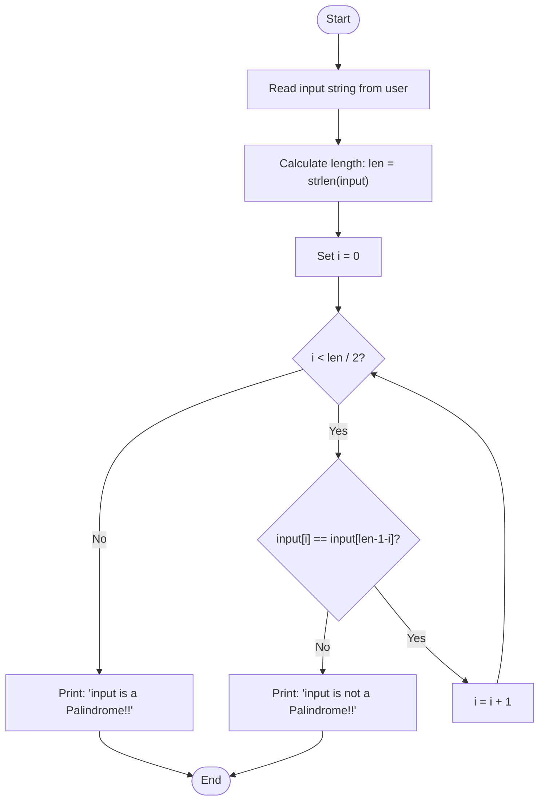

# `palindrome.c` — Documentation

## Overview

**`palindrome.c`** is a C program that checks whether a user-supplied string or number is a **palindrome** — a sequence that reads the same forwards and backwards.

Given an input string, the program:
1. Measures its length.
2. Compares characters from the **outside inward** using a two-pointer technique.
3. Reports whether the input is a palindrome or not.

Examples of palindromes: `racecar`, `madam`, `12321`, `level`.

---

## File Structure

| Element | Description |
|---|---|
| `#include <stdio.h>` | Standard I/O — `printf()`, `scanf()` |
| `#include <string.h>` | String utilities — `strlen()` |
| `char input_value[40]` | Buffer to hold up to 39 characters of user input |
| `int len` | Stores the length of the input string |
| `for` loop | Iterates from both ends inward, comparing mirror characters |
| Early `return 0` | Exits immediately on the first mismatch found |

---

## How It Works

### 1. Input
The user enters a string or number (no spaces). It is stored in a 40-character buffer.

### 2. Length calculation
`strlen()` computes the number of characters (excluding the null terminator `\0`).

### 3. Two-pointer comparison
The loop runs from `i = 0` up to `i < len / 2`, comparing:

| Left index `i` | Right index `len - 1 - i` |
|---|---|
| 0 (first char) | len − 1 (last char) |
| 1 | len − 2 |
| … | … |
| midpoint | midpoint |

- If any pair **mismatches** → print "not a Palindrome" and exit immediately.
- If the loop finishes with **no mismatches** → print "is a Palindrome".

> **Why only `len / 2` iterations?**  
> A palindrome mirrors around its centre. The middle character (if the length is odd) always equals itself, so checking half the string is sufficient.

---

## Flowchart



---

## Example Runs

### Example 1 — Palindrome string
```
Enter a string or number: racecar
racecar is a Palindrome!!
```

### Example 2 — Palindrome number
```
Enter a string or number: 12321
12321 is a Palindrome!!
```

### Example 3 — Not a palindrome
```
Enter a string or number: hello
hello is not a Palindrome!!
```

### Example 4 — Single character (always a palindrome)
```
Enter a string or number: a
a is a Palindrome!!
```

---

## Compilation & Execution

```bash
# Compile
gcc palindrome.c -o palindrome

# Run
./palindrome
```

---

## Known Limitations

- **Buffer overflow risk**: The input buffer is fixed at 40 characters. Input longer than 39 characters will overflow. Consider using `fgets()` for safer input.
- **Case sensitivity**: `"Racecar"` and `"racecar"` are treated differently. The check is case-sensitive.
- **No space support**: `scanf("%s", ...)` stops at whitespace, so phrases like `"never odd or even"` cannot be checked without preprocessing.
