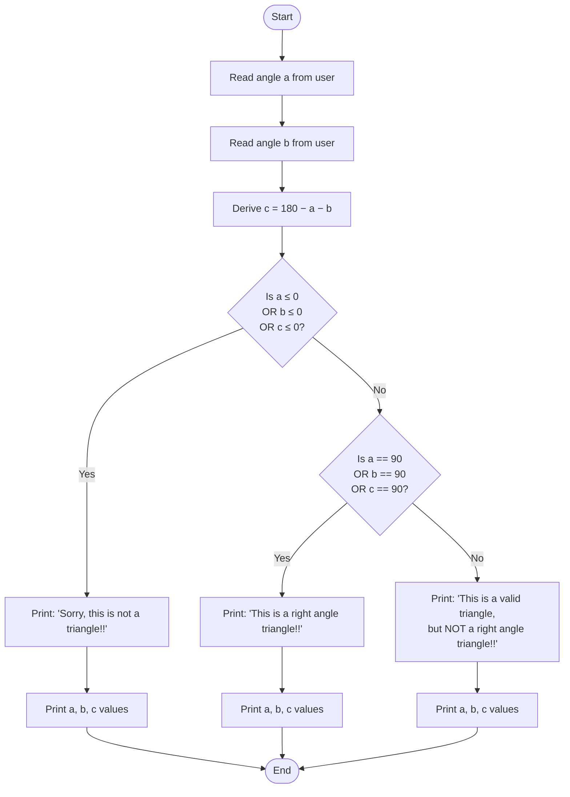

# `right_angle.c` — Documentation

## Overview

**`right_angle.c`** is a small C program that determines whether two user-supplied angles can form a **right-angle triangle**.

Given two angles `a` and `b`, the program:
1. Derives the third angle `c = 180 − a − b`.
2. Validates that all three angles are strictly positive (ensuring a real triangle).
3. Checks whether any angle equals exactly **90°**, classifying the triangle accordingly.

---

## File Structure

| Element | Description |
|---|---|
| `#include <stdio.h>` | Includes the standard I/O library for `printf` / `scanf` |
| `float a, b, c` | Variables that store the three interior angles |
| Input block | Reads angles `a` and `b` from `stdin` |
| Derivation | Computes `c = 180 − a − b` |
| Validation | Rejects non-positive angles (invalid triangles) |
| Classification | Identifies right-angle vs. ordinary valid triangles |

---

## How It Works

### 1. Input
The user enters two angles (`a` and `b`) as floating-point numbers.

### 2. Third-angle derivation
Because the interior angles of any triangle sum to **180°**, the third angle is:

```
C = 180 − A − B
```

### 3. Validation
A valid triangle requires every interior angle to be **strictly greater than 0**.  
If any of `a`, `b`, or `c` is ≤ 0, the input cannot form a triangle.

### 4. Classification
| Condition | Output |
|---|---|
| Any angle ≤ 0 | `"Sorry, this is not a triangle!!"` |
| Any angle == 90 | `"This is a right angle triangle!!"` |
| All other valid triangles | `"This is a valid triangle, but NOT a right angle triangle!!"` |

All branches also print the values of a, b, and c rounded to **2 decimal places**.

---

## Flowchart



---

## Example Runs

### Example 1 — Right-angle triangle
```
Enter the first angle: 90
Enter the second angle: 45
This is a right angle triangle!!
A = 90.00, B = 45.00, C = 45.00
```

### Example 2 — Valid, non-right-angle triangle
```
Enter the first angle: 60
Enter the second angle: 60
This is a valid triangle, but NOT a right angle triangle!!
A = 60.00, B = 60.00, C = 60.00
```

### Example 3 — Invalid input
```
Enter the first angle: 100
Enter the second angle: 100
Sorry, this is not a triangle!!
A = 100.00, B = 100.00, C = -20.00
```

---

## Compilation & Execution

```bash
# Compile
gcc right_angle.c -o right_angle

# Run
./right_angle
```

---

## Known Limitations

- **Floating-point equality**: Comparing a `float` with `== 90` can fail due to floating-point precision errors. For more robust code, consider using a small epsilon tolerance (e.g., `fabsf(a - 90.0f) < 1e-6f`).
- **No input validation**: The program does not check for non-numeric input; entering letters or symbols will cause undefined behaviour via `scanf`.
